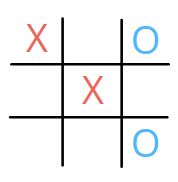
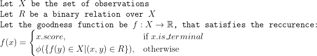

Tictactoe is probably one of the easiest and earliest games played by humans. Its easy to design a strategy that is _unbeatable_. But, does a better strategy exist ? 

>This post intentionally avoids using **only** ''reinforcement learning'' terminology, in order to cater to a broader audience.  

> _Prerequisites_: python, recursion, numpy, high-school maths 

### Tictactoe: Objective and Design
#### Objective:
Tictactoe is a two player game, played on a 3X3 board, where players alternate in choosing one of the nine cells to make their mark. The objective is to get three of your marks in a line, either vertical,horizontal or diagonal. If a player completes the objective, they win, and automatically, the opponent loses, and vice versa. If neither player has completed the objective and the board gets filled, the game ends in a draw.   

#### Design: 
The two players are denoted as Player 1 and Player 2, with Player 1 making the first move. The game ends with a single score, that takes values from {1, 0, -1} indicating Player 1 wins, Draw and Player 2 wins respectively. For visual representations, consider marks for players 1 and 2 to be 'X' and 'O' respectively, although we'll use 1 and 2 to denote marks for the corresponding players. 0 is used to denote empty or unmarked cell. 

The game works on the concept of an **observation**, which is a 4-tuple object that describes the current view of the game. The elements of the tuple are:
1. board : array of 9 integers, indicating mark for each cell
2. turn : indicates the player whose turn it is
3. is_terminal : indicates whether the game has ended
4. score : denotes the score of the game if it has ended, otherwise takes value 0



Above game view can be represented as following Observation object:

```python
(
  board: array([1, 0, 2, 0, 1, 0, 0, 0, 2], dtype=int8),
  turn: 1,
  is_terminal: False,
  score: 0
)
```

We'll use two methods for running a game: _begin_ and _forward_. The former returns an initial observation of the game, while the latter returns a new observation, given current observation and an **action**(new mark position for player whose turn it is). 

```python
import Game
obs = Game.begin()
print("at t=0: ", obs)
obs = Game.forward(obs, 2)
print("at t=1: ", obs)
```
Output 
:
```python
at t=0: Game.Observation(board=array([0, 0, 0, 0, 0, 0, 0, 0, 0], dtype=int8), turn=1, is_terminal=False, score=0)
at t=1: Game.Observation(board=array([0, 0, 1, 0, 0, 0, 0, 0, 0], dtype=int8), turn=2, is_terminal=False, score=0)
```
### Solution Structure
Anyone who has played tictactoe would agree that the general playing strategy is to choose actions that take you closer to a win, and at the same time keeps opponent from forcing a win. A possible way to do this is by ranking each observation based on its _goodness_, and choosing actions that take you to the _best_ possible observation. To realise this, we must define what this _goodness_ is. 

Mathematically speaking, this _goodness_ is simply a real valued function defined on the set of observations. Since the observations share a causal relationship, we suppose that their values too must exhibit some **mathematical relation**. We introduce following notation to formalize this:



We can see that we can arrive at the exact meaning of f once we choose what R and Phi are. R is relatively easy to define. 'xRy' denotes a parent-child relationship between the observations x and y. Alternatively, y is a successor of x, so there exists some action that can take the game from x to y. Thus, Phi is a function applied on the set of _goodness_ values of these successors. One may notice that the operation performed by Phi depends on what strategy is used  

In this section, we seek to try to understand the way game evolves and This way of scoring allows us to vaguely define **value** of the game, as the expected score of the game when it terminates. Now we can write the objective of the game mathematically, for both the players 1 and 2 as simply maximizing or minimizing this value.
